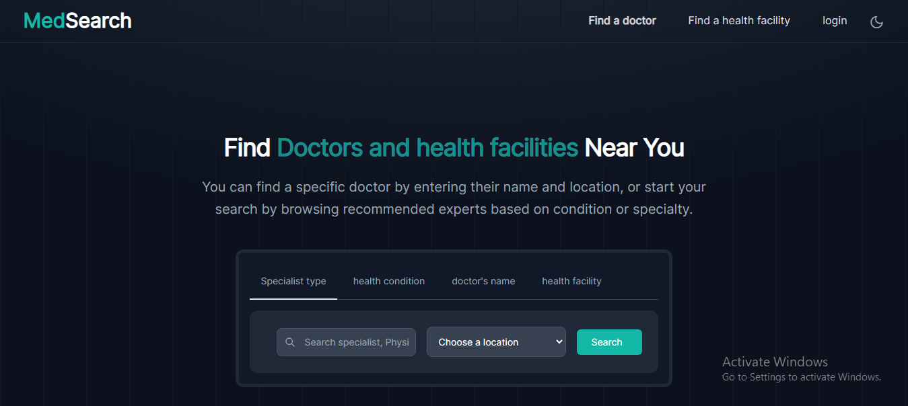

<!-- PROJECT LOGO -->
<br />
<div align="center">
  <a href="https://github.com/kudah99/medsearch">
    
  </a>

<h3 align="center">MedSearch</h3>

  <p align="center">
    MedSearch is a user-friendly online platform designed to facilitate the seamless discovery 
    of medical specialists and healthcare facilities. This platform employs
     advanced artificial intelligence to provide an efficient and personalized 
     experience for users seeking healthcare professionals based on specific 
     conditions or symptoms.
    <br />
    <br />
    <br />
    <a href="https://www.medsearch.co.zw">View Site</a>
    ·
    <a href="https://github.com/kudah99/medsearch/issues">Report Bug</a>
    ·
    <a href="https://github.com/kudah99/medsearch/issues">Request Feature</a>
  </p>
</div>


### Built With

- 
- 
- 
- 
- 

<p align="right">(<a href="#readme-top">back to top</a>)</p>

<!-- GETTING STARTED -->

## Getting Started

This is an example of how you may give instructions on setting up your project locally.
To get a local copy up and running follow these simple example steps.

### Installation

1. Clone the repo
   ```sh
   git clone https://github.com/kudah99/medsearch.git
   ```
2. Install dependencies
   ```sh
   pip install -r requirements.txt
   ```
3. Setup environment variables `.env`. Below is an example `.env` file

   ```py
   DB_NAME=postgres
   DB_USER=user
   DB_PASSWORD=123
   DB_HOST=127.0.0.1
   DB_PORT=5432
   DB_ENGINE=postgresql
   SECRET_KEY=your-django-key
   DEBUG=True

   ```

<p align="right">(<a href="#readme-top">back to top</a>)</p>

## Contributing

Contributions are what make the open source community such an amazing place to learn, inspire, and create. Any contributions you make are **greatly appreciated**.

If you have a suggestion that would make this better, please fork the repo and create a pull request.
Don't forget to give the project a star! Thanks again!

1. Fork the Project
2. Create your Feature Branch (`git checkout -b feature/AmazingFeature`)
3. Commit your Changes (`git commit -m 'Add some AmazingFeature'`)
4. Push to the Branch (`git push origin feature/AmazingFeature`)
5. Open a Pull Request

<p align="right">(<a href="#readme-top">back to top</a>)</p>

<!-- LICENSE -->

## License

Distributed under the MIT License. See `LICENSE.txt` for more information.

<p align="right">(<a href="#readme-top">back to top</a>)</p>

<!-- CONTACT -->

## Contact

Kudakwashe Chris Chipangura - [@kudachipangura](https://twitter.com/kudachipangura)

Project Link: [https://github.com/kudah99/medsearch](https://github.com/kudah99/medsearch)

<p align="right">(<a href="#readme-top">back to top</a>)</p>

<!-- ACKNOWLEDGMENTS -->

## Acknowledgments

- [Free Hosting By Vercel](https://vercel.com/)
- [Free Postgreql Database Hosting](https://www.elephantsql.com/)

<p align="right">(<a href="#readme-top">back to top</a>)</p>
